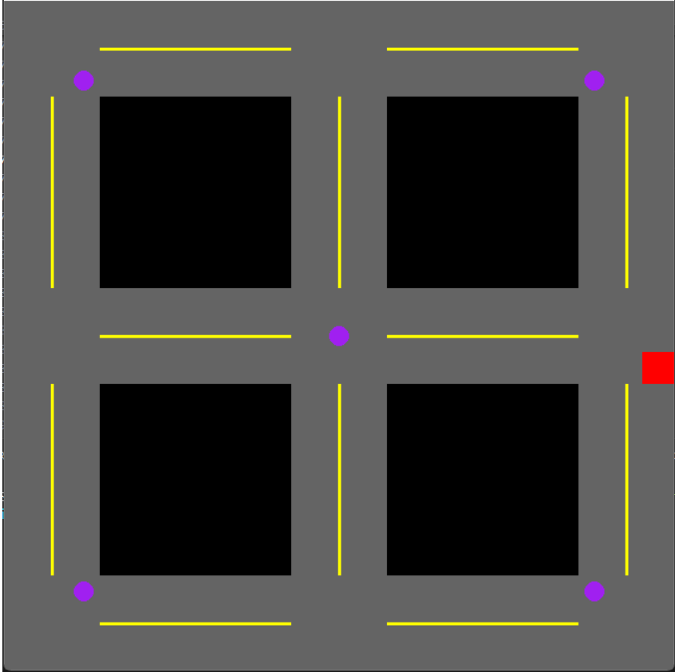

# Smart City Indoor Localization & Navigation

This repository serves as the core framework for an intelligent indoor navigation system, developed as part of a Smart City project. It enables an agent (representing an autonomous vehicle) to smoothly navigate to any designated target point after determining its current position. A realistic environment has been created to parallel real-world conditions and serve as a training ground for reinforcement learning models.

## Overview

The system is designed to integrate with an indoor localization solution that utilizes ESP32 microcontrollers and a Flask server to estimate position based on WiFi signal strength. You can find the localization module source code [here](https://github.com/algamelomer/indoor-localization.git).

### Key Components

1. **Basic Environment (`smart_city_env.py`)**  
   - Simulates a city grid where roads are represented by a binary map.
   - The agent moves along predefined paths, collecting signal points located at virtual "tower" positions.
   - Serves as a proof-of-concept for integrating with real-world localization data.

2. **Advanced Environment with DQN (`smart_city_DQN.py`)**  
   - Integrates reinforcement learning (Deep Q-Network) to enhance navigation capabilities.
   - Uses noisy layers for improved exploration and learning stability.
   - The agent learns to autonomously navigate toward dynamically assigned target points, receiving rewards for optimal movement decisions.

## Features

### Environment Structure

The smart city environment is structured as a **21x21 grid**, where road segments define valid movement paths.

| Symbol | Description |
|--------|-------------|
| `0`    | Obstacle (Building, Restricted Area) |
| `1`    | Road (Valid Movement Area) |
| `A-E`  | Signal Towers (Localization Points) |
| `S`    | Start Position of Agent |
| `T`    | Target Position |

### Agent Navigation

The agent can perform the following movements:

| Action | Description |
|--------|-------------|
| `↑` (Up)    | Moves one step upward if a road exists |
| `↓` (Down)  | Moves one step downward if a road exists |
| `←` (Left)  | Moves one step left if a road exists |
| `→` (Right) | Moves one step right if a road exists |

The navigation logic follows:
- The agent starts at a random position on the road.
- It moves toward the target while following predefined movement constraints.
- In the reinforcement learning version, the agent receives **reward signals** for choosing optimal paths.

### Reinforcement Learning Implementation

- **Deep Q-Network (DQN) with Experience Replay**: Improves training efficiency and prevents catastrophic forgetting.
- **Noisy Layers**: Introduced to encourage better exploration of possible paths.
- **Target Network**: Used to stabilize training by reducing oscillations in Q-value updates.

## Future Development & Integration

This project is intended to evolve into a fully autonomous smart city navigation system. Planned enhancements include:

- **Full Integration with Indoor Localization**  
  The system will incorporate real-time WiFi-based localization data to allow dynamic position tracking.

- **Traffic Rules & Priority Handling**  
  Future versions will simulate real-world traffic rules, intersections, and priority-based decision-making.

- **Autonomous City Navigation**  
  The final objective is to enable the agent to navigate **freely within the smart city** without requiring predefined waypoints.

## Installation Requirements

- Python 3.6+
- [Gym](https://www.gymlibrary.ml/)
- [NumPy](https://numpy.org/)
- [Pygame](https://www.pygame.org/news)
- [PyTorch](https://pytorch.org/) (for the reinforcement learning model)

Install dependencies with:
```bash
pip install gym numpy pygame torch
```

## Usage

### Running the Basic Environment
```bash
python smart_city_env.py
```
This will:
- Initialize the environment.
- Place the agent at a random starting point.
- Allow movement until all signal towers are visited.
- Render the simulation using Pygame.

### Running the DQN Navigation Model
```bash
python smart_city_DQN.py
```
This will:
- Train the agent using deep reinforcement learning.
- Save the trained model.
- Test navigation efficiency under different conditions.

## Environment Visualization

Below is an example of the environment rendered using Gym:



